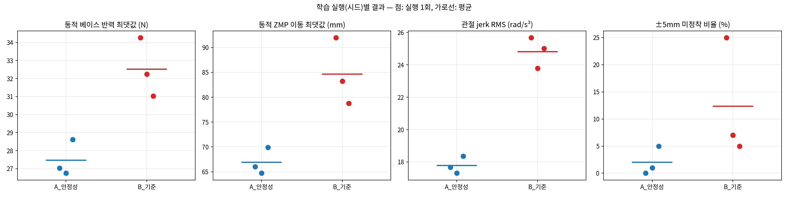
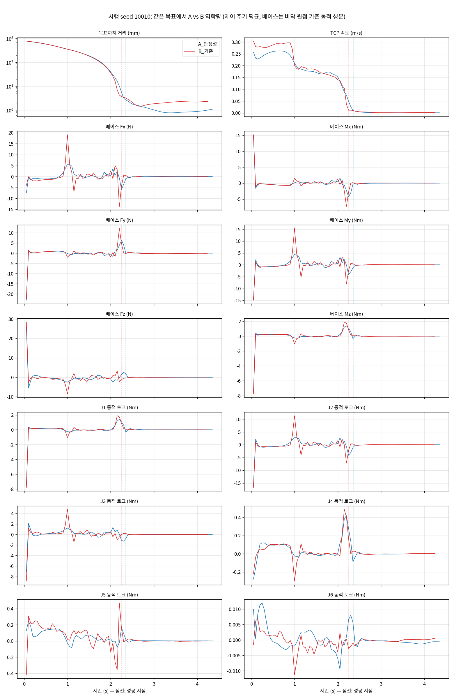

# 동적 안정성을 고려한 강화학습 기반 로봇 암 경로 최적화

두산로보틱스 **E0509** 협동로봇(6축) + **Robotiq 2F-85** 그리퍼가 작업 공간 내 임의의 목표점에 도달하는 동작을 **SAC 강화학습**으로 학습하고, 보상 함수에 **동역학 안정성 항목**(베이스 반력, 관절 동적 토크, 가속도·jerk)을 넣었을 때 동작이 실제로 역학적으로 안정해지는지를 **통제 비교 실험(시드 3개)** 으로 검증한 프로젝트입니다.

> **결과 요약** — 안정성 항목을 넣은 모델(A)은 넣지 않은 모델(B)과 같은 성공률·도달 시간을 유지하면서, 베이스 전도 모멘트 **−21%**, 어깨 관절(J2) 동적 토크 **−20%**, 관절 jerk **−28%** 를 기록했습니다. 3개 학습 시드 모두에서 A의 가장 나쁜 실행이 B의 가장 좋은 실행보다 나았습니다.
> 단, 도달 후 정착·정확도 개선은 시드를 늘리자 재현되지 않았습니다 ([6. 결과](#6-결과), [7. 한계](#7-한계)).

---

## 목차
1. [배경과 목표](#1-배경과-목표)
2. [시스템 구성](#2-시스템-구성)
3. [강화학습 환경](#3-강화학습-환경)
4. [보상 함수](#4-보상-함수)
5. [실험 설계](#5-실험-설계)
6. [결과](#6-결과)
7. [한계](#7-한계)
8. [실행 방법](#8-실행-방법)
9. [파일 구조](#9-파일-구조)
10. [프로젝트 이력 (Franka Panda → Doosan E0509)](#10-프로젝트-이력-franka-panda--doosan-e0509)
11. [라이선스와 출처](#11-라이선스와-출처)

---

## 1. 배경과 목표

물체를 인식해 집는 로봇 시연에서 두 가지 문제가 관찰되었습니다.

1. **세부 모션 계획 부족** — 물체를 인식해도 *어떻게* 접근할지에 대한 경로가 불분명해 엔드이펙터(EE) 위치가 흔들렸습니다.
2. **동역학적 불안정** — 로봇이 거리 최소화에만 몰입해 모든 관절이 급격히 목표로 빨려 들어가고, 그 관성 하중이 베이스 프레임을 흔들어 EE 정확도가 떨어졌습니다.

이 프로젝트의 목표는 **목표점 도달 성능을 유지하면서, 베이스와 관절에 걸리는 동적 하중이 작은 경로를 강화학습으로 찾는 것**입니다.

## 2. 시스템 구성

| 항목 | 내용 |
|---|---|
| 로봇 | 두산로보틱스 E0509 (6축, 가반하중 5kg, 도달거리 900mm) — 공식 URDF ([doosan-robot2](https://github.com/DoosanRobotics/doosan-robot2)) |
| 그리퍼 | Robotiq 2F-85, 열린 상태로 고정 장착 (0.925kg). EE = 손가락 사이 TCP (플랜지에서 156mm) |
| 시뮬레이터 | PyBullet, 240Hz 물리 / 20Hz 제어 |
| 알고리즘 | SAC (Stable-Baselines3), 병렬 환경 14개, 학습 500만 스텝 (실행당 약 52분, i5-14600KF + RTX 4060) |
| 관절 토크 한계 | URDF 정격값 J1~J3 194Nm, J4~J6 66Nm |

> 프로젝트는 7축 Franka Panda로 시작했으며 현재는 6축 E0509로 전환했습니다. 저장소 이름의 "7-Axis"는 초기 버전을 가리킵니다 ([10. 이력](#10-프로젝트-이력-franka-panda--doosan-e0509)).

## 3. 강화학습 환경

`Doosan_E0509_train.py`의 `E0509Env`

| 항목 | 내용 |
|---|---|
| 행동 (6) | 관절별 위치 증분 ∈ [−1, 1] × 0.03rad/스텝 (최대 0.6rad/s) → 위치 제어 |
| 관측 (30) | 관절각 6 + 관절속도 6 + TCP 위치 3 + 목표 상대위치 3 + 직전 행동 6 + 그 이전 행동 6 |
| 목표 생성 | x 0.2~0.7m, y ±0.5m, z 0.1~0.8m 중 IK 해가 관절 한계 안에 있고, 바닥과 충돌하지 않으며, 실제로 5mm 이내 도달 가능한 점만 채택 |
| 초기 자세 | 두산 홈 자세 (0, 0, 90°, 0, 90°, 0) ± 0.3rad 무작위 |
| 성공 (종료) | TCP–목표 거리 < 5mm **그리고** TCP 속도 < 2cm/s (정착) |
| 시간 제한 | 500스텝 (25초) |

직전 두 행동을 관측에 넣은 이유는 스무딩·jerk 페널티가 행동 이력에 의존하기 때문입니다(마르코프 성질 유지).

## 4. 보상 함수

매 제어 스텝(0.05s)마다:

```
r = −20·d − 200·min(d, 0.02)                       거리 (d: TCP–목표 거리, m)
    − 10  · mean(((τ − τ_g) / τ_max)²)              동적 토크 (중력 보상분 제외, 정격 토크로 정규화)
    − 1.5 · [(|F_dyn| / 208N)² + (|M_dyn| / 194Nm)²]  베이스 동적 반력·모멘트
    − 3   · mean((a_t − a_{t−1})²)                  가속도 (스무딩)
    − 3   · mean((a_t − 2a_{t−1} + a_{t−2})²)       jerk
    − 10  (바닥 접촉 시, 종료하지 않음)
    + 150 (성공 시, 종료)
```

| 항목 | 설계 의도 |
|---|---|
| 거리 | 2cm 밖은 기울기 20, 2cm 안은 220으로 정밀 접근 유도. 2cm 경계에서 연속, **항상 ≤ 0** |
| 동적 토크 | 실제 토크에서 같은 자세의 중력 토크 τ_g를 뺀 값 → 팔을 뻗는 것 자체가 아니라 *움직임* 에 의한 부하만 벌함 |
| 베이스 반력 | 팔 전체 운동량의 시간 미분 (뉴턴–오일러): F_dyn = dP/dt, M_dyn = dL/dt. 베이스를 흔드는 관성 하중. PyBullet 반력 센서와 평균 0.17N 이내로 일치 확인 |
| 스무딩 / jerk | 행동 = 속도 명령이므로 1차 차분 ≈ 가속도, 2차 차분 ≈ jerk |
| 바닥 접촉 | 종료하지 않고 스텝마다 감점 → "충돌로 에피소드를 빨리 끝내는" 꼼수 차단 |
| 정착 조건 | 빠르게 통과하는 것은 성공이 아님 → 오버슈트 없이 멈추도록 유도 |

**설계 과정에서 얻은 교훈**
- 초기 보상은 목표 2cm 이내에서 스텝 보상이 **양수**였습니다. 그 결과 에이전트가 5mm 바로 밖(약 6~7mm)에 머물며 보상을 쌓는 **reward hacking**을 학습했습니다(3.5M 스텝에서 성공률 1/20). → 성공 전까지 모든 스텝 보상이 0 이하가 되도록 수정.
- 처음 가중치(v1: 스무딩·jerk 0.1)로 학습한 정책을 분석해 보니 두 항목이 안정성 페널티 합의 **1%** 에 불과해 사실상 작동하지 않았습니다(베이스 78%, 토크 21%). → v2에서 3.0으로 상향. 결과 섹션은 v2 기준입니다.
- 안정성 페널티 합은 거리 항목의 약 16% 수준입니다(학습된 정책 기준).

## 5. 실험 설계

**질문**: 안정성 항목을 보상에 넣으면 같은 과제를 더 역학적으로 안정하게 수행하는가?

| 조건 | 보상 | 그 외 |
|---|---|---|
| **A (제안)** | 위 보상 전체 (v2 가중치) | 환경, 성공 조건, 하이퍼파라미터, 학습량 모두 동일 |
| **B (기준)** | 거리 + 바닥 접촉 + 성공만 (`stability=False`) | |

- **학습 시드 3개씩** (A: 1, 2, 3 / B: 1, 2, 3). 강화학습은 실행마다 결과 편차가 커서, 단일 실행 비교는 운과 효과를 구분하지 못합니다. 실제로 시드 1끼리만 비교했을 때 보였던 효과 일부가 시드 2, 3에서 재현되지 않았습니다.
- **평가**: 학습·이전 테스트와 겹치지 않는 동일한 무작위 목표 100개(seed 10000~10099)를 모든 모델에 적용, 결정적 정책, 성공 후 2초 유지 관찰.
- **분석 단위 = 학습 실행 1회**: 실행마다 목표 100개 평균을 내고 조건 간 비교. "일관성" = A의 가장 나쁜 실행이 B의 가장 좋은 실행보다 나은가.
- **역학량 계산**: 240Hz 원시 데이터 기록 → 뉴턴–오일러로 베이스 동적 힘·모멘트(바닥 원점 기준), ZMP, 관절 동적 토크. 힘·모멘트·토크·가속도는 **제어 주기(0.05s) 평균**으로 계산했습니다. PyBullet 위치 제어는 목표가 바뀔 때마다 한 서브스텝(1/240s) 동안 정격 토크급 충격을 만드는데, 이는 정책과 무관한 시뮬레이터 특성이라 240Hz 최댓값이 정책 간 차이를 가리기 때문입니다.
- **계산 검증**: 정지 시 동적 반력·ZMP 이동 = 0, 전방 가속 시 ZMP 후방 이동(부호), 베이스 수직축 모멘트 Mz = J1 토크(4.94 vs 4.96Nm), 반력 = PyBullet 센서값.

## 6. 결과

### 6.1 주 지표 (사전 정의, 시드 3개)

| 지표 | A (시드 1/2/3) | B (시드 1/2/3) | A 평균 | B 평균 | 변화 | 일관성 |
|---|---|---|---|---|---|---|
| 동적 베이스 반력 최댓값 | 27.0 / 26.7 / 28.6 N | 34.3 / 32.2 / 31.0 N | 27.5 ± 1.0 | 32.5 ± 1.6 | **−15.5%** | 모든 A < 모든 B |
| 동적 ZMP 이동 최댓값 | 66.1 / 64.7 / 69.9 mm | 92.0 / 83.2 / 78.8 mm | 66.9 ± 2.7 | 84.7 ± 6.7 | **−21.0%** | 모든 A < 모든 B |
| 관절 jerk RMS | 17.7 / 17.3 / 18.4 rad/s³ | 25.7 / 23.8 / 25.0 rad/s³ | 17.8 ± 0.5 | 24.8 ± 1.0 | **−28.4%** | 모든 A < 모든 B |



### 6.2 베이스 프레임 힘·모멘트와 관절 토크 (같은 목표끼리 짝지은 평균, 시드 쌍 3개)

| 항목 | A | B | 변화 |
|---|---|---|---|
| 베이스 Fx (전후) 최댓값 | 17.7 N | 23.0 N | −23% |
| 베이스 Fz (수직) 최댓값 | 16.5 N | 19.7 N | −16% |
| 베이스 My (전후 전도 모멘트) 최댓값 | 14.8 Nm | 18.7 Nm | **−21%** |
| 베이스 Mx (좌우 전도 모멘트) 최댓값 | 5.98 Nm | 7.41 Nm | −19% |
| 베이스 Mz (수직축) 최댓값 | 4.94 Nm | 5.76 Nm | −14% |
| J1 동적 토크 최댓값 | 4.96 Nm | 5.78 Nm | −14% |
| **J2 (어깨) 동적 토크 최댓값** | **11.8 Nm** | **14.8 Nm** | **−20%** |
| J3 (팔꿈치) 동적 토크 최댓값 | 5.99 Nm | 7.16 Nm | −16% |
| J4 / J5 / J6 동적 토크 최댓값 | 1.28 / 0.56 / 0.031 Nm | 1.49 / 0.65 / 0.038 Nm | −14 / −14 / −18% |

39개 역학 항목 전부가 3개 시드 쌍 모두에서 A가 낮았습니다(전체 표: [`dynamics_tables/summary_table.md`](dynamics_tables/summary_table.md)). 다만 이 항목들은 모두 "팔의 가속도"라는 같은 원인에서 나오므로 독립적인 증거 39개가 아니라 **"관성 하중 감소"라는 하나의 결과**로 보는 것이 정확합니다.

보상에 직접 넣지 않은 역학량도 함께 감소했습니다: 토크 변화율 −25%, 운동 에너지 최댓값 −14%, 기계적 일 −9%, TCP 가속도 −9%, 도달 후 잔류 베이스 반력 −34%.

**같은 시행 예시 (초기 거리 최장 목표, 시드 2 쌍)** — B는 약 1.0초 감속 구간에서 Fx 19N, My 15Nm, J2 11Nm가 동시에 튀지만 A는 완만하게 감속합니다.



### 6.3 과제 성능과 재현되지 않은 효과

| 지표 | A (시드 1/2/3) | B (시드 1/2/3) | 판단 |
|---|---|---|---|
| 성공률 | 100 / 100 / 100 % | 96 / 100 / 100 % | 차이 없음 |
| 도달 시간 | 1.34 / 1.48 / 1.33 s | 1.54 / 1.31 / 1.30 s | 차이 없음 (속도 손해 없음) |
| 최종 오차 | 3.67 / 3.98 / 3.38 mm | 3.75 / 2.94 / 3.08 mm | 차이 없음 |
| ±5mm 미정착 비율 (2초 유지 중 이탈) | 0 / 1 / 5 % | 25 / 7 / 5 % | 겹침 |
| 정착 시간(±2%), 오버슈트, 도달 후 흔들림 | — | — | 겹침 |

시드 1끼리의 비교에서는 A가 도달 후 정착·정확도도 크게 우세했지만(미정착 0% vs 25%), B 시드 1이 늦게 수렴한 이례적인 실행이었던 것으로 확인되어 이 주장은 **철회**했습니다.

### 6.4 보조 분석 (시드 1, v1 가중치 — 참고용)

[`compare_results/`](compare_results/)에는 시드 1 모델 한 쌍으로 수행한 상세 분석이 있습니다: 스텝 응답(상승·정착 시간, 퍼센트 오버슈트), 실험적 주파수 응답(목표를 사인파로 움직여 추종 이득·위상·반력 전달률 측정). 이전 README에서 "다음 프로젝트"로 계획했던 스텝/하모닉 입력 분석의 첫 시도입니다. 시드 1개이고 비선형 시스템의 기술 함수(진폭 20mm)이므로 참고용으로만 봐야 합니다.

## 7. 한계

- **베이스는 강체로 고정**되어 실제로 흔들리지 않습니다. 이 프로젝트가 보인 것은 "베이스를 흔들 *하중* 의 감소"이며, 배경에서 제기한 "흔들림 → EE 정확도 저하"의 개선은 이 시뮬레이션으로 검증하지 못했습니다(6.3).
- **하중의 절대 크기가 작습니다.** 동적 토크는 정격의 2~8%, 베이스 동적 반력은 팔 무게(208N)의 약 15%입니다. 행동 크기 제한(최대 약 0.25m/s TCP 속도)이 이미 동작을 많이 제약하고 있습니다.
- **고전 제어 방식과의 비교가 없습니다.** IK + 최소 jerk 궤적 같은 해석적 방법 대비 위치는 아직 확인하지 않았습니다.
- **통계**: 시드 3 대 3에서 "모든 A < 모든 B"가 우연히 나올 확률은 1/20(단측). B 시드 1은 SAC 쪽 시드(신경망 초기값 등)가 고정되지 않은 모델이며, v2 가중치는 v1 결과를 본 뒤 정했습니다.
- **시뮬레이터 특성**: PyBullet 위치 제어의 20Hz 계단식 목표 때문에 TCP 속도가 제어 주기 안에서 톱니 모양으로 진동하며, 실제 로봇 제어기(궤적 보간)와 다릅니다. 절대값보다 A/B 상대 비교로 해석해야 합니다.
- **ZMP**는 지지 면적을 모르므로 전도 *위험* 이 아니라 전도 *경향* 의 상대 비교입니다.

## 8. 실행 방법

```bash
python3 -m venv .venv && source .venv/bin/activate
pip install -r requirements.txt        # Python 3.10에서 검증
```

| 목적 | 명령 |
|---|---|
| A 학습 (안정성 보상) | `python Doosan_E0509_train.py --seed 1` |
| B 학습 (기준) | `python Doosan_E0509_train_baseline.py --seed 1` |
| 시드 실험 일괄 실행 (5회 순차) | `./run_seeds.sh` |
| GUI로 한 모델 테스트 | `python Doosan_E0509_test.py e0509_2f85_sac_v2_s1.zip` |
| **A/B 나란히 보기 (창 2개, 같은 목표 동시 출발)** | `python Doosan_E0509_viewer.py` (특정 목표: `--seeds 10010`, 슬로모션: `--speed 0.5`) |
| 시드별 비교 | `python Doosan_E0509_compare_seeds.py --a e0509_2f85_sac_v2_s{1,2,3}.zip --b e0509_2f85_sac_nostab.zip e0509_2f85_sac_nostab_s{2,3}.zip` |
| 성분별 역학량 표·같은 시행 시계열 | `python Doosan_E0509_dynamics_table.py` |
| 한 쌍 상세 비교 (스텝 응답 등) | `python Doosan_E0509_compare.py --models A.zip B.zip` |
| 주파수 응답 | `python Doosan_E0509_bode.py --models A.zip B.zip` |

학습 중 텐서보드: `tensorboard --logdir e0509_2f85_logs`

## 9. 파일 구조

```
Doosan_E0509_train.py            환경(E0509Env) + A 학습. stability / record 옵션
Doosan_E0509_train_baseline.py   B 학습 (stability=False)
run_seeds.sh                     시드 실험 순차 실행
Doosan_E0509_test.py             GUI 단일 모델 테스트
Doosan_E0509_viewer.py           A/B 동시 GUI 비교
Doosan_E0509_compare.py          한 쌍 상세 비교 (역학 지표, 스텝 응답, 그래프)
Doosan_E0509_compare_seeds.py    시드(학습 실행) 단위 비교
Doosan_E0509_dynamics_table.py   베이스 힘·모멘트 / 관절 토크 성분별 표와 같은 시행 시계열
Doosan_E0509_bode.py             실험적 주파수 응답
assets/e0509/                    E0509 URDF(+그리퍼 결합본), 메시
assets/robotiq_2f85/             2F-85 메시
e0509_2f85_sac_v2_s{1,2,3}.zip   A 최종 모델 (시드별)
e0509_2f85_sac_nostab*.zip       B 최종 모델 (시드 1, 2, 3)
e0509_2f85_sac.zip               A v1 가중치 모델 (6.4 보조 분석용)
compare_seeds_results/           시드별 비교 결과
dynamics_tables/                 성분별 역학량 표, 같은 시행 표·그래프·CSV
compare_results/                 시드 1 상세 분석 (스텝 응답, 주파수 응답 등)
seed_report.md                   시드 실험 진행 기록과 해석
Project_final_1000*.py, panda_*  이전 버전 (Franka Panda)
```

체크포인트, 텐서보드 로그, 학습 로그는 용량 때문에 저장소에서 제외했습니다(학습 스크립트로 재생성 가능).

## 10. 프로젝트 이력 (Franka Panda → Doosan E0509)

초기 버전(`Project_final_1000.py`, 7축 Franka Panda, 1000만 스텝)은 목표 5mm 이내 95% 도달을 보고했지만, 이후 코드 검토에서 다음 문제가 확인되어 E0509 버전에서 수정했습니다.

| 문제 | 수정 |
|---|---|
| 목표 근처 스텝 보상이 양수 → 근처에 머무는 reward hacking 가능 | 스텝 보상 ≤ 0 |
| 충돌 시 −10 후 종료 → 충돌로 에피소드를 끝내는 편이 이득일 수 있음 | 종료 없이 스텝마다 감점 |
| 토크 페널티가 중력 토크에 지배됨 (정지 자세에서도 큰 감점) | 중력 보상분을 뺀 동적 토크만 사용 |
| 스무딩 페널티가 직전 행동에 의존하지만 관측에 없음 | 직전 행동들을 관측에 추가 |
| IK 한계 리스트 길이(7)가 Panda 자유도(9)와 불일치 → 관절 한계 무시 | 자유도와 일치시키고 IK 결과의 한계 검사 |
| 정적 평가만 수행 (성공률) | 역학량·시드 단위 통제 비교 |

이전 README의 "다음 프로젝트"(동적 안정성 정량 평가, 스텝·하모닉 입력 응답, 보드 선도)는 이 버전의 5~6장에서 일부 수행했습니다.

이전 버전 시연 영상: [거리 보상만](https://youtu.be/T843mICs6Xk) / [동적 안정성 보상 포함](https://youtu.be/lcWTP0zjzf0)

## 11. 라이선스와 출처

- E0509 URDF·메시: [DoosanRobotics/doosan-robot2](https://github.com/DoosanRobotics/doosan-robot2) `dsr_description2` (BSD-3-Clause, `assets/e0509/LICENSE`). 메시 경로만 PyBullet용 STL로 변경.
- Robotiq 2F-85 메시: doosan-robot2 `mujoco_models/2f85` (MuJoCo Menagerie 파생, BSD-2-Clause, `assets/robotiq_2f85/LICENSE`). MJCF 바디를 고정 조인트 URDF로 변환, 장착 위치는 doosan-robot2 `dsr_merge_gripper.py`와 동일.
